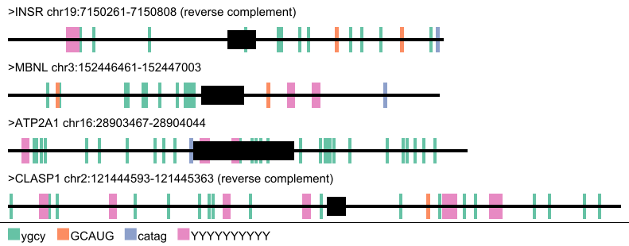

# motif-mark

Motif mark visualizes motifs found across nucleotides, as well as which regions are introns or exons. Note that this current iteration does not stagger motifs to show overlapping of motifs.

Parsing the motifs file does support IUPAC ambiguous nucleotide codes, and will dynamically size the output image based on the number of reads in the provided fasta, as well as the length of the longest read.

Currently only up to 8 unique motifs are supported, with a fixed brewer palette. Future versions may implement optional inclusion of custom color palettes through addition of deliminators to the motif file.

## Run the program

Provide properly input fasta file and motifs file (one motif per line).

```bash
./motif-mark-oop -f FASTA -m MOTIFS
```

## Example

Here is an example of running motif mark and the corresponding output:

```bash
./motif-mark-oop.py -f Figure_1.fasta -m Fig_1_motifs.txt
```



